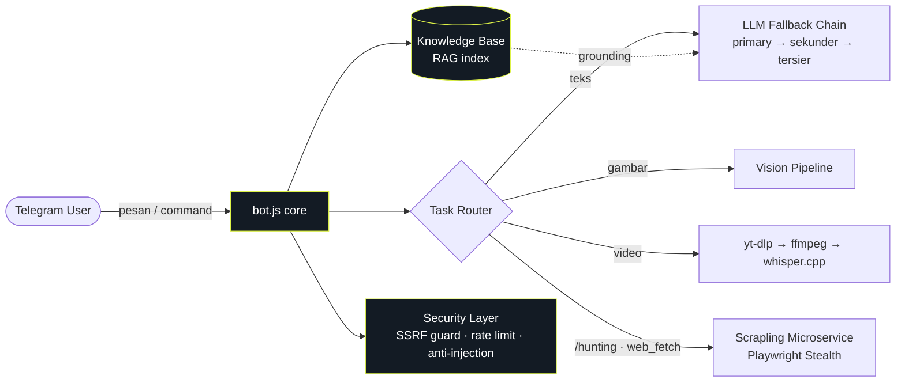

<div align="center">

# 🤖 COPUX-FourFect Bot

**Asisten Telegram bertenaga AI untuk komunitas emulasi Windows-di-Android**

Winlator · GameHub · BannerHub · GameNative · Box86/64 · FEX · DXVK · Turnip

[](https://nodejs.org)
[](https://pm2.keymetrics.io)
[](#)
[](https://t.me/Noysz_bot)
[](#-lisensi)

</div>

---

## 📖 Ringkasan

**COPUX-FourFect** adalah bot Telegram yang dibangun untuk menangani ribuan pertanyaan teknis berulang di komunitas emulator Windows-di-Android. Alih-alih sekadar chatbot, bot ini punya **kapabilitas eksekusi nyata**: membaca screenshot error, menonton video, mengaudit file konfigurasi, mencari di web dengan proteksi anti-bot, dan menjawab dari **knowledge base** internal (RAG) sebelum menyentuh internet — untuk meminimalkan halusinasi.

Dirancang **hemat resource** agar berjalan mulus di Termux/ARM (HP Android) maupun VPS.

> **Live:** [`@Noysz_bot`](https://t.me/Noysz_bot) · **Runtime:** Node.js + PM2

---

## 📑 Daftar Isi

- [Fitur Utama](#-fitur-utama)
- [Arsitektur](#-arsitektur)
- [Daftar Perintah](#-daftar-perintah)
- [Instalasi](#-instalasi)
- [Konfigurasi](#-konfigurasi)
- [Menjalankan Bot](#-menjalankan-bot)
- [Knowledge Base & Tuning](#-knowledge-base--tuning)
- [Keamanan](#-keamanan)
- [Kontribusi](#-kontribusi)
- [Lisensi](#-lisensi)

---

## ✨ Fitur Utama

### 🧠 Otak LLM Multi-Provider dengan Fallback Berlapis
Router cerdas memilih jalur LLM berdasarkan jenis tugas, dengan **rantai fallback otomatis** — jika provider utama down/error, permintaan mengalir mulus ke provider berikutnya tanpa memutus percakapan.
- **Teks** → provider utama → fallback sekunder → tersier (semua OpenAI-compatible, dikonfigurasi via `.env`).
- **Vision** → pipeline terpisah khusus model bermata.
- **Grounding anti-halusinasi** → dipaksa merujuk Knowledge Base (RAG) dulu untuk topik teknis sebelum menjawab.

### 👁️ Smart Vision — Analisis Screenshot
Kirim screenshot error, log, atau layar pengaturan emulator yang membingungkan. Bot membaca isinya (OCR + reasoning visual) dan menganalisis penyebab crash secara instan. *(Dilengkapi magic-byte detection untuk menangani MIME `application/octet-stream` dari Telegram.)*

### 🎬 AI Video Watcher — Bot Bisa "Nonton"
Kirim video (≤20MB) atau link YouTube/TikTok/MP4. Bot akan:
1. Mengunduh stream via `yt-dlp`.
2. Mengekstrak frame visual + audio 16kHz via `ffmpeg`.
3. Transkripsi audio via **`whisper.cpp`** (native, optimal untuk ARM).
4. Menganalisis visual **dan** suara sekaligus, lalu memberi rangkuman/panduan.

### 🔍 Game Distribution Indexer & Web Search
- **Indexer (`/hunting`)** — mencari rilis game PC (Pre-installed / Portable) dari beberapa sumber, mengembalikan tautan langsung. Ditenagai microservice **Scrapling** (Playwright Stealth) untuk menembus proteksi Cloudflare, dengan *relevancy check* agar hasil tidak acak.
- **Web Search (`/cari`)** — pencarian web dengan fallback bertingkat: **Serper → Tavily → DuckDuckGo**.
- **Web Fetch Anti-Bot** — pengambilan halaman via Scrapling, dengan **proteksi SSRF ketat** sebelum request diproses.

### 🛠️ Steam Config Auditor & DLC Generator
Asisten khusus ekosistem Android-Wine (Winlator, GameHub):
- **On-the-Fly Config Audit** — upload `steam_emu.ini` / `Ali213.ini` / `steam_appid.txt`, bot membaca asinkron & mendeteksi parameter `AppId`/`Language` yang korup/hilang.
- **DLC Config Generator (`/dlc <appid>`)** — meracik file unlocker DLC (standar CreamAPI/Goldberg) dari hasil scrape API publik Steam.
- **Library Override Detector** — mendeteksi lingkungan Winlator (`drive_c`) & memberi panduan _Native then Builtin_ agar game tidak crash.

### 👥 Community Knowledge Base (Moderated)
Member menyumbang fix via `/addfix`. Admin meninjau antrean lewat **tombol inline interaktif** (`/promotefix`) — baca teks penuh tiap kontribusi, lalu **✓ Promote** (masuk KB + reindex) atau **❌ Reject** (buang) per item. Semua kontribusi disanitasi (anti prompt-injection) sebelum masuk KB.

### 🎨 Antarmuka Telegram Rapi
- Format MarkdownV2 dengan fallback plain-text otomatis (tidak pernah gagal kirim).
- Menu perintah otomatis (`bot.setMyCommands`) — ketik `/` untuk melihat daftar fitur, terpisah antara scope publik & admin.

---

## 🏗️ Arsitektur



| Komponen | Peran |
|----------|-------|
| **`bot.js`** | Core: routing, sesi per-user, rate limit, agentic tool-loop |
| **LLM Fallback Chain** | Multi-provider OpenAI-compatible, failover otomatis |
| **Vision Pipeline** | Analisis screenshot (OCR + reasoning) |
| **Video Watcher** | `yt-dlp` + `ffmpeg` + `whisper.cpp` |
| **`scrapling_service.py`** | Microservice Python (Playwright Stealth) anti-Cloudflare |
| **Knowledge Base (RAG)** | Grounding jawaban dari `data/kb/*.md` |
| **Security Layer** | SSRF guard, rate limit, sanitasi input |

---

## 📋 Daftar Perintah

**Publik**
| Perintah | Fungsi |
|----------|--------|
| `/start` | Memulai sesi bot |
| `/cari <query>` | Pencarian web mendalam (Serper → Tavily → DDG) |
| `/hunting <game>` | Cari rilis game PC (Pre-installed/Portable) |
| `/dlc <appid>` | Generate DLC config override (CreamAPI/Goldberg) |
| `/addfix <isi>` | Sumbang fix/trik ke Community KB (via review admin) |
| `/opus <pertanyaan>` | Tanya model frontier untuk reasoning berat |
| `/profile` | Lihat/atur profil perangkat (chipset, emulator, dll) |
| `/reset` | Hapus konteks memori percakapan |

**Admin** (`ADMIN_IDS`)
| Perintah | Fungsi |
|----------|--------|
| `/status` | Status VPS, PM2, disk, LLM, queue |
| `/stats` | Metrik sistem internal |
| `/llmstatus` · `/llmroute` · `/llmtest` | Kelola & tes routing LLM runtime |
| `/reloadenv` | Reload `.env` tanpa restart |
| `/reloadkb` · `/reindexkb` | Muat ulang / rebuild index Knowledge Base |
| `/promotefix` | Review antrean `/addfix` via tombol (promote/reject per item) |
| `/backup` | Jalankan backup sekarang |

---

## 🚀 Instalasi

> Karena kapabilitasnya (baca video, bypass Cloudflare, LLM), bot butuh beberapa dependensi tambahan. Ikuti bertahap.

### Tahap 1 — Core Bot
```bash
# Prasyarat: Node.js ≥ 18 (disarankan 20+), git, PM2
npm install -g pm2

git clone https://github.com/Noysz/Bot-Telegram.git
cd Bot-Telegram
npm install
cp .env.example .env      # lalu isi nilainya (lihat bagian Konfigurasi)
```

### Tahap 2 — Scrapling Microservice *(wajib untuk `/hunting` & web fetch)*
Service Python yang berjalan di background untuk menembus Cloudflare/bot-protection.
```bash
python3 -m venv .venv
.venv/bin/pip install "scrapling[fetchers,ai]"
.venv/bin/scrapling install      # unduh chromium playwright

pm2 start .venv/bin/python --name copux-scrapling --interpreter none -- scrapling_service.py
```
<details>
<summary>💡 Tes microservice via cURL</summary>

```bash
curl -s -X POST http://127.0.0.1:8765/api/v1/hunt-game \
  -H "Content-Type: application/json" \
  -d '{"query": "elden ring"}'
```
</details>

### Tahap 3 — AI Video Watcher *(wajib untuk analisis video)*
```bash
# 1. yt-dlp & ffmpeg (apt / pkg Termux)
pkg install yt-dlp ffmpeg

# 2. Build whisper.cpp native (JANGAN faster-whisper di ARM)
cd ~
git clone https://github.com/ggml-org/whisper.cpp
cd whisper.cpp && cmake -B build && cmake --build build

# 3. Unduh model
bash ./models/download-ggml-model.sh base
```
> Sesuaikan path `WHISPER_BIN` & `WHISPER_MODEL` di `.env` dengan lokasi build.

---

## ⚙️ Konfigurasi

Salin `.env.example` → `.env`, lalu isi. Variabel inti:

```env
# === WAJIB ===
TELEGRAM_TOKEN=token_dari_botfather
ADMIN_IDS=123456789,987654321        # user_id admin, pisah koma

# === LLM (OpenAI-compatible) ===
COPUX_API_URL=https://provider-lu/v1/chat/completions
COPUX_API_KEY=xxxxxxxx
TEXT_MODEL=nama-model
VISION_MODEL=nama-model

# Fallback berlapis (pisah koma, urutan sejajar) — dipakai kalau primary error
LLM_FALLBACK_URLS=
LLM_FALLBACK_MODELS=
LLM_FALLBACK_KEYS=

# Vision & /opus (opsional, endpoint terpisah)
VISION_API_URL=
VISION_API_KEY=
VISION_API_MODEL=
OPUS_API_URL=
OPUS_API_KEY=
OPUS_API_MODEL=

# === VIDEO ===
WHISPER_BIN=/root/whisper.cpp/build/bin/whisper-cli
WHISPER_MODEL=/root/whisper.cpp/models/ggml-base.bin

# === SEARCH (opsional — fallback otomatis ke DuckDuckGo) ===
SERPER_API_KEY=
TAVILY_API_KEY=
FIRECRAWL_API_KEY=
```

> 🔐 **Jangan commit `.env` asli.** Semua secret via environment variable. Lihat [`.env.example`](.env.example) untuk daftar lengkap (webhook, ops panel, tuning resource, backup, dll).

---

## ▶️ Menjalankan Bot

```bash
# Start bot utama
pm2 start bot.js --name copux

# Persist agar auto-run saat reboot
pm2 save
pm2 startup

# (Sekali saja) daftarkan menu perintah ke Telegram
node scripts/setup-bot-metadata.js

# Pantau log realtime
pm2 logs copux --lines 50
```

---

## 🧠 Knowledge Base & Tuning

Seluruh panduan troubleshooting emulasi ada di `data/kb/*.md` (fork Winlator, Wine/Proton, DXVK, dll). Bot merujuk pustaka ini via **RAG** sebelum ke internet — menjamin akurasi & mencegah halusinasi. Admin bisa `/reloadkb` atau `/reindexkb` tanpa restart.

Parameter tuning (`MAX_HISTORY`, `MAX_CONCURRENT_LLM`, `MAX_PHOTO_BYTES`, dll) sudah di-default efisien untuk 4–6GB RAM dan bisa disesuaikan di `.env` (turunkan untuk HP low-RAM, naikkan untuk server lega).

---

## 🔒 Keamanan

- **SSRF Guard** — blokir IP privat (RFC1918) & DNS-pinning anti-rebinding sebelum web fetch.
- **Anti Prompt-Injection** — sanitasi tag berbahaya sebelum konten masuk history/KB.
- **Resource Management** — semaphore membatasi concurrency LLM & proses video; atomic write menjaga history tidak korup saat server mati mendadak.
- **Sesi & Rate Limit** — karantina sesi per-user, 20 pesan / 60 detik + cooldown 5 detik.
- **Admin Gate** — perintah sensitif & moderasi KB dibatasi `ADMIN_IDS`.

---

## 🤝 Kontribusi

Kontribusi dipersilakan. Buka [issue](https://github.com/Noysz/Bot-Telegram/issues) untuk bug/saran, atau kirim Pull Request:

1. Fork repo & buat branch fitur (`git checkout -b fitur/nama`).
2. Commit dengan pesan deskriptif (format [Conventional Commits](https://www.conventionalcommits.org)).
3. Pastikan `node -c bot.js` lolos & fitur diverifikasi.
4. Buka PR dengan ringkasan perubahan + cara tes.

Riwayat perubahan lengkap ada di [`CHANGELOG.md`](CHANGELOG.md).

---

## 📄 Lisensi

**ISC** © [Noysz](https://github.com/Noysz) — *Fourfect Group*

<div align="center">
<sub>Dibangun untuk komunitas emulasi Windows-di-Android 🎮 · berjalan hemat di ARM/Termux</sub>
</div>
